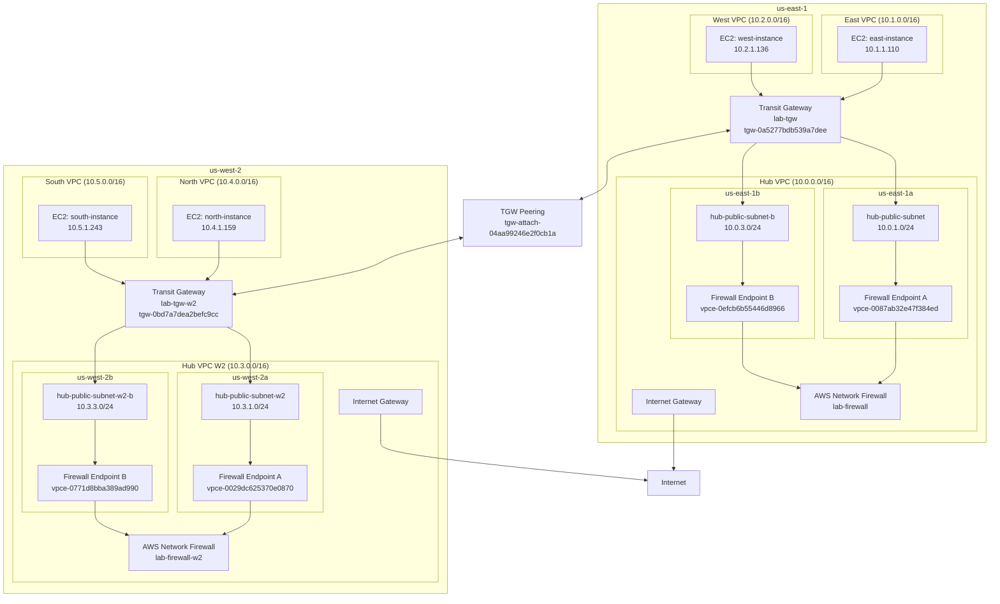

# AWS IAC Lab Architecture

## Network Diagram



## Overview

Multi-region hub and spoke AWS network architecture built with OpenTofu across
two regions (us-east-1 and us-west-2), each with two AZs. All infrastructure
is defined as code and state is stored remotely in S3.

**Traffic flow (same-region spoke to spoke):**
```
east-instance → TGW → hub-public-subnet → Firewall Endpoint → Firewall inspection
→ hub-firewall-subnet → TGW → west-instance
```

**Traffic flow (cross-region spoke to spoke):**
```
east-instance → TGW (e1) → TGW Peering → TGW (w2) → north-instance
```

The `ttl=126` on same-region ICMP confirms two firewall hops.
The `ttl=125` on cross-region ICMP confirms three hops (e1 firewall + peering + w2 firewall).

---

## State Backend (bootstrapped manually via AWS CLI)

| Resource | Name | Purpose |
|---|---|---|
| S3 Bucket | `351668480009-opentofu-state` | Stores all `.tfstate` files |
| DynamoDB Table | `opentofu-state-lock` | Prevents concurrent `tofu apply` runs |

| Lab | State Key |
|---|---|
| lab-01-vpc | `hub-vpc/terraform.tfstate` |
| lab-02-vpn | `east-vpc/terraform.tfstate` |
| lab-03-vpc | `west-vpc/terraform.tfstate` |
| lab-04-firewall | `firewall/terraform.tfstate` |
| lab-05-tgw | `tgw/terraform.tfstate` |
| lab-06-ec2 | `ec2/terraform.tfstate` |
| lab-07-vpc-w2 | `hub-vpc-w2/terraform.tfstate` |
| lab-08-firewall-w2 | `firewall-w2/terraform.tfstate` |
| lab-09-tgw-w2 | `tgw-w2/terraform.tfstate` |
| lab-10-ec2-w2 | `ec2-w2/terraform.tfstate` |

---

## lab-01-vpc — Hub VPC (us-east-1)

**Location:** `opentofu/lab-01-vpc/`
**CIDR:** `10.0.0.0/16`

**Purpose:** Central hub VPC in us-east-1. All spoke traffic is routed through
this VPC for firewall inspection. Mirrors the connectivity account pattern used
in enterprise AWS Landing Zone deployments.

### Resources

| Resource | Name Tag | AZ | Purpose |
|---|---|---|---|
| `aws_vpc` | `hub-vpc` | — | The VPC itself |
| `aws_subnet` | `hub-public-subnet` | us-east-1a | TGW attachment subnet AZ-a |
| `aws_subnet` | `hub-firewall-subnet` | us-east-1a | Firewall endpoint subnet AZ-a |
| `aws_subnet` | `hub-public-subnet-b` | us-east-1b | TGW attachment subnet AZ-b |
| `aws_subnet` | `hub-firewall-subnet-b` | us-east-1b | Firewall endpoint subnet AZ-b |
| `aws_internet_gateway` | `hub-igw` | — | Internet connectivity |
| `aws_route_table` | `hub-public-rt` | us-east-1a | Routes spoke traffic to firewall endpoint A |
| `aws_route_table` | `hub-public-rt-b` | us-east-1b | Routes spoke traffic to firewall endpoint B |
| `aws_route_table` | `hub-firewall-rt` | us-east-1a | Routes post-inspection traffic back to TGW |
| `aws_route_table` | `hub-firewall-rt-b` | us-east-1b | Routes post-inspection traffic back to TGW |

---

## lab-02-vpn — East Spoke VPC

**Location:** `opentofu/lab-02-vpn/`
**CIDR:** `10.1.0.0/16`

**Purpose:** East spoke VPC in us-east-1. Connects to hub via Transit Gateway.

### Resources

| Resource | Name Tag | AZ | Purpose |
|---|---|---|---|
| `aws_vpc` | `east-vpc` | — | The VPC itself |
| `aws_subnet` | `east-public-subnet` | us-east-1a | Workload subnet AZ-a |
| `aws_subnet` | `east-public-subnet-b` | us-east-1b | Workload subnet AZ-b |
| `aws_internet_gateway` | `east-igw` | — | Internet connectivity |
| `aws_route_table` | `east-public-rt` | us-east-1a | Routes cross-VPC traffic via TGW |
| `aws_route_table` | `east-public-rt-b` | us-east-1b | Routes cross-VPC traffic via TGW |

---

## lab-03-vpc — West Spoke VPC (us-east-1)

**Location:** `opentofu/lab-03-vpc/`
**CIDR:** `10.2.0.0/16`

**Purpose:** West spoke VPC in us-east-1. Mirrors east VPC in structure.

### Resources

| Resource | Name Tag | AZ | Purpose |
|---|---|---|---|
| `aws_vpc` | `west-vpc` | — | The VPC itself |
| `aws_subnet` | `west-public-subnet` | us-east-1a | Workload subnet AZ-a |
| `aws_subnet` | `west-public-subnet-b` | us-east-1b | Workload subnet AZ-b |
| `aws_internet_gateway` | `west-igw` | — | Internet connectivity |
| `aws_route_table` | `west-public-rt` | us-east-1a | Routes cross-VPC traffic via TGW |
| `aws_route_table` | `west-public-rt-b` | us-east-1b | Routes cross-VPC traffic via TGW |

---

## lab-04-firewall — AWS Network Firewall (us-east-1)

**Location:** `opentofu/lab-04-firewall/`

**Purpose:** Deploys AWS Network Firewall into both firewall subnets of the
hub VPC in us-east-1. Inspects all traffic flowing between spoke VPCs.

### Resources

| Resource | Name Tag | Purpose |
|---|---|---|
| `aws_networkfirewall_rule_group` | `lab-stateless-rules` | Forwards all TCP to stateful engine |
| `aws_networkfirewall_rule_group` | `lab-stateful-rules` | Blocks traffic to known bad domains (Suricata rules) |
| `aws_networkfirewall_firewall_policy` | `lab-firewall-policy` | Combines rule groups |
| `aws_networkfirewall_firewall` | `lab-firewall` | Firewall deployed across both AZ subnets |

### Outputs

| Output | Value | Purpose |
|---|---|---|
| `firewall_endpoint_az_a` | `vpce-0087ab32e47f384ed` | Used by lab-05-tgw for AZ-a routes |
| `firewall_endpoint_az_b` | `vpce-0efcb6b55446d8966` | Used by lab-05-tgw for AZ-b routes |

**Note:** Endpoint IDs change on every destroy/apply cycle. After rebuilding,
run `tofu apply` in `lab-04-firewall`, get new IDs from outputs, then update
the `locals` block in `lab-05-tgw/main.tf` before applying TGW.

---

## lab-05-tgw — Transit Gateway (us-east-1)

**Location:** `opentofu/lab-05-tgw/`

**Purpose:** Creates Transit Gateway in us-east-1 and connects hub, east, and
west VPCs. Updates all route tables for spoke-to-spoke traffic via firewall.

### Resources

| Resource | Name Tag | Purpose |
|---|---|---|
| `aws_ec2_transit_gateway` | `lab-tgw` | Central router (tgw-0a5277bdb539a7dee) |
| `aws_ec2_transit_gateway_vpc_attachment` | `tgw-attach-hub` | Hub VPC attachment |
| `aws_ec2_transit_gateway_vpc_attachment` | `tgw-attach-east` | East VPC attachment |
| `aws_ec2_transit_gateway_vpc_attachment` | `tgw-attach-west` | West VPC attachment |

---

## lab-06-ec2 — Test EC2 Instances (us-east-1)

**Location:** `opentofu/lab-06-ec2/`

**Purpose:** Deploys `t3.micro` EC2 instances in east and west spoke VPCs for
connectivity testing.

### Resources

| Resource | Name Tag | Purpose |
|---|---|---|
| `aws_instance` | `east-instance` | Amazon Linux 2023, east-public-subnet |
| `aws_instance` | `west-instance` | Amazon Linux 2023, west-public-subnet |

### Connectivity test
```bash
ssh -i opentofu/lab-06-ec2/lab-key.pem ec2-user@<east_public_ip>
ping <west_private_ip>
# Expected: ttl=126 (2 firewall hops)
```

---

## lab-07-vpc-w2 — Hub + Spoke VPCs (us-west-2)

**Location:** `opentofu/lab-07-vpc-w2/`

**Purpose:** Deploys hub VPC and two spoke VPCs in us-west-2, mirroring the
us-east-1 topology.

### Resources

| Resource | Name Tag | CIDR | AZs |
|---|---|---|---|
| `aws_vpc` | `hub-vpc-w2` | 10.3.0.0/16 | us-west-2a, us-west-2b |
| `aws_vpc` | `north-vpc` | 10.4.0.0/16 | us-west-2a, us-west-2b |
| `aws_vpc` | `south-vpc` | 10.5.0.0/16 | us-west-2a, us-west-2b |

---

## lab-08-firewall-w2 — AWS Network Firewall (us-west-2)

**Location:** `opentofu/lab-08-firewall-w2/`

**Purpose:** Deploys AWS Network Firewall into hub-vpc-w2 in us-west-2.
Same rule structure as lab-04-firewall.

### Outputs

| Output | Value | Purpose |
|---|---|---|
| `firewall_endpoint_az_a` | `vpce-0029dc625370e0870` | Used by lab-09-tgw-w2 for AZ-a routes |
| `firewall_endpoint_az_b` | `vpce-0771d8bba389ad990` | Used by lab-09-tgw-w2 for AZ-b routes |

**Note:** Endpoint IDs change on every destroy/apply cycle. Update the
`locals` block in `lab-09-tgw-w2/main.tf` after rebuilding.

---

## lab-09-tgw-w2 — Transit Gateway + Peering (us-west-2)

**Location:** `opentofu/lab-09-tgw-w2/`

**Purpose:** Creates Transit Gateway in us-west-2, attaches hub/north/south
VPCs, establishes TGW peering with us-east-1 TGW, and configures all routing
on both sides using provider aliasing.

### Key concept — provider aliasing
This lab uses two AWS providers simultaneously:
- Default provider → us-west-2 (creates west TGW, attachments, routes)
- `aws.east` alias → us-east-1 (accepts peering, adds east-side TGW and VPC routes)

### Resources

| Resource | Name Tag | Purpose |
|---|---|---|
| `aws_ec2_transit_gateway` | `lab-tgw-w2` | West TGW (tgw-0bd7a7dea2befc9cc) |
| `aws_ec2_transit_gateway_vpc_attachment` | `tgw-attach-hub-w2` | Hub VPC attachment |
| `aws_ec2_transit_gateway_vpc_attachment` | `tgw-attach-north` | North VPC attachment |
| `aws_ec2_transit_gateway_vpc_attachment` | `tgw-attach-south` | South VPC attachment |
| `aws_ec2_transit_gateway_peering_attachment` | `tgw-peering-w2-to-e1` | Peering request from west |
| `aws_ec2_transit_gateway_peering_attachment_accepter` | `tgw-peering-w2-to-e1` | Accepted on east side |

### Peering attachment ID
`tgw-attach-04aa99246e2f0cb1a`

---

## lab-10-ec2-w2 — Test EC2 Instances (us-west-2)

**Location:** `opentofu/lab-10-ec2-w2/`

**Purpose:** Deploys `t3.micro` EC2 instances in north and south spoke VPCs
for cross-region connectivity testing.

### Resources

| Resource | Name Tag | Purpose |
|---|---|---|
| `aws_instance` | `north-instance` | Amazon Linux 2023, north-public-subnet |
| `aws_instance` | `south-instance` | Amazon Linux 2023, south-public-subnet |

### Cross-region connectivity test
```bash
ssh -i opentofu/lab-06-ec2/lab-key.pem ec2-user@<east_public_ip>
ping <north_private_ip>
# Expected: ttl=125 (3 hops: e1 firewall + peering + w2 firewall)
```

---

## Deployment Order

```
1. lab-01-vpc        (no dependencies)
2. lab-02-vpn        (no dependencies)
3. lab-03-vpc        (no dependencies)
4. lab-04-firewall   (depends on lab-01-vpc)
5. lab-05-tgw        (depends on lab-01 through lab-04)
6. lab-06-ec2        (depends on lab-02-vpn, lab-03-vpc)
7. lab-07-vpc-w2     (no dependencies)
8. lab-08-firewall-w2 (depends on lab-07-vpc-w2)
9. lab-09-tgw-w2     (depends on lab-05-tgw, lab-07-vpc-w2, lab-08-firewall-w2)
10. lab-10-ec2-w2    (depends on lab-07-vpc-w2)
```

## Teardown Order

```
1. lab-10-ec2-w2
2. lab-06-ec2
3. lab-09-tgw-w2
4. lab-08-firewall-w2
5. lab-07-vpc-w2
6. lab-05-tgw
7. lab-04-firewall
8. lab-03-vpc
9. lab-02-vpn
10. lab-01-vpc
```

---

## Important: After Destroy/Redeploy

Firewall endpoint IDs change every time a firewall lab is destroyed and
redeployed. After rebuilding:

**us-east-1:**
1. Run `tofu apply` in `lab-04-firewall` — note new endpoint IDs in outputs
2. Update `locals` block in `lab-05-tgw/main.tf`
3. Run `tofu apply` in `lab-05-tgw`

**us-west-2:**
1. Run `tofu apply` in `lab-08-firewall-w2` — note new endpoint IDs in outputs
2. Update `locals` block in `lab-09-tgw-w2/main.tf`
3. Run `tofu apply` in `lab-09-tgw-w2`

---

## Cost Reference (~$2.10/hr when fully deployed)

| Resource | Qty | Rate | $/hr |
|---|---|---|---|
| Network Firewall endpoints (us-east-1) | 2 | $0.395 | $0.79 |
| Network Firewall endpoints (us-west-2) | 2 | $0.395 | $0.79 |
| TGW attachments (us-east-1) | 3 | $0.05 | $0.15 |
| TGW attachments (us-west-2) | 3 | $0.05 | $0.15 |
| TGW peering | 1 | $0.10 | $0.10 |
| EC2 t3.micro x4 | 4 | ~$0.011 | $0.04 |
| **Total** | | | **~$2.02/hr** |
