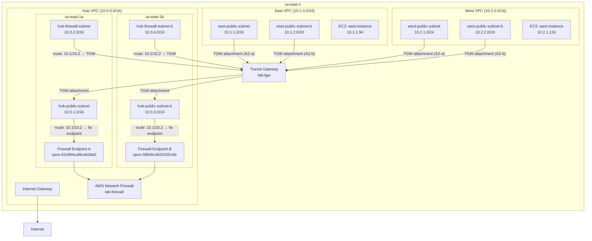

# AWS IAC Lab Architecture

## Network Diagram



## Overview

Hub and spoke AWS network architecture built with OpenTofu across two AZs.
All infrastructure is defined as code and state is stored remotely in S3.

**Traffic flow (spoke to spoke):**
```
east-instance → TGW → hub-public-subnet → Firewall Endpoint → Firewall inspection
→ hub-firewall-subnet → TGW → west-instance
```

The `ttl=126` (vs 128) on ICMP responses confirms traffic transits two hops
through the hub, proving the firewall inspection path is active.

---

## State Backend (bootstrapped manually via AWS CLI)

| Resource | Name | Purpose |
|---|---|---|
| S3 Bucket | `351668480009-opentofu-state` | Stores all `.tfstate` files |
| DynamoDB Table | `opentofu-state-lock` | Prevents concurrent `tofu apply` runs |

| Lab | State Key |
|---|---|
| lab-01-vpc | `hub-vpc/terraform.tfstate` |
| lab-02-vpn | `east-vpc/terraform.tfstate` |
| lab-03-vpc | `west-vpc/terraform.tfstate` |
| lab-04-firewall | `firewall/terraform.tfstate` |
| lab-05-tgw | `tgw/terraform.tfstate` |
| lab-06-ec2 | `ec2/terraform.tfstate` |

---

## lab-01-vpc — Hub VPC

**Location:** `opentofu/lab-01-vpc/`
**CIDR:** `10.0.0.0/16`

**Purpose:** Central hub VPC in the hub and spoke architecture. All spoke
traffic is routed through this VPC for firewall inspection. Mirrors the
connectivity account pattern used in enterprise AWS Landing Zone deployments.

### Resources

| Resource | Name Tag | AZ | Purpose |
|---|---|---|---|
| `aws_vpc` | `hub-vpc` | — | The VPC itself |
| `aws_subnet` | `hub-public-subnet` | us-east-1a | TGW attachment subnet AZ-a |
| `aws_subnet` | `hub-firewall-subnet` | us-east-1a | Firewall endpoint subnet AZ-a |
| `aws_subnet` | `hub-public-subnet-b` | us-east-1b | TGW attachment subnet AZ-b |
| `aws_subnet` | `hub-firewall-subnet-b` | us-east-1b | Firewall endpoint subnet AZ-b |
| `aws_internet_gateway` | `hub-igw` | — | Internet connectivity |
| `aws_route_table` | `hub-public-rt` | us-east-1a | Routes spoke traffic to firewall endpoint A |
| `aws_route_table` | `hub-public-rt-b` | us-east-1b | Routes spoke traffic to firewall endpoint B |
| `aws_route_table` | `hub-firewall-rt` | us-east-1a | Routes post-inspection traffic back to TGW |
| `aws_route_table` | `hub-firewall-rt-b` | us-east-1b | Routes post-inspection traffic back to TGW |

### Referenced by
- `lab-04-firewall` — deploys firewall into `hub-firewall-subnet` and `hub-firewall-subnet-b`
- `lab-05-tgw` — attaches hub VPC to TGW using both public subnets

---

## lab-02-vpn — East Spoke VPC

**Location:** `opentofu/lab-02-vpn/`
**CIDR:** `10.1.0.0/16`

**Purpose:** East spoke VPC. Connects to hub via Transit Gateway. Represents
a workload VPC that relies on the hub for centralized security inspection.

### Resources

| Resource | Name Tag | AZ | Purpose |
|---|---|---|---|
| `aws_vpc` | `east-vpc` | — | The VPC itself |
| `aws_subnet` | `east-public-subnet` | us-east-1a | Workload subnet AZ-a |
| `aws_subnet` | `east-public-subnet-b` | us-east-1b | Workload subnet AZ-b |
| `aws_internet_gateway` | `east-igw` | — | Internet connectivity |
| `aws_route_table` | `east-public-rt` | us-east-1a | Routes cross-VPC traffic via TGW |
| `aws_route_table` | `east-public-rt-b` | us-east-1b | Routes cross-VPC traffic via TGW |

### Referenced by
- `lab-05-tgw` — attaches east VPC to TGW using both public subnets
- `lab-06-ec2` — deploys test EC2 instance into `east-public-subnet`

---

## lab-03-vpc — West Spoke VPC

**Location:** `opentofu/lab-03-vpc/`
**CIDR:** `10.2.0.0/16`

**Purpose:** West spoke VPC. Mirrors east VPC in structure.

### Resources

| Resource | Name Tag | AZ | Purpose |
|---|---|---|---|
| `aws_vpc` | `west-vpc` | — | The VPC itself |
| `aws_subnet` | `west-public-subnet` | us-east-1a | Workload subnet AZ-a |
| `aws_subnet` | `west-public-subnet-b` | us-east-1b | Workload subnet AZ-b |
| `aws_internet_gateway` | `west-igw` | — | Internet connectivity |
| `aws_route_table` | `west-public-rt` | us-east-1a | Routes cross-VPC traffic via TGW |
| `aws_route_table` | `west-public-rt-b` | us-east-1b | Routes cross-VPC traffic via TGW |

### Referenced by
- `lab-05-tgw` — attaches west VPC to TGW using both public subnets
- `lab-06-ec2` — deploys test EC2 instance into `west-public-subnet`

---

## lab-04-firewall — AWS Network Firewall

**Location:** `opentofu/lab-04-firewall/`

**Purpose:** Deploys AWS Network Firewall into both firewall subnets of the
hub VPC. Inspects all traffic flowing between spoke VPCs. Two endpoints
provide AZ redundancy mirroring enterprise two-firewall-per-region patterns.

### Resources

| Resource | Name Tag | File | Purpose |
|---|---|---|---|
| `aws_networkfirewall_rule_group` | `lab-stateless-rules` | `main.tf:23` | Forwards all TCP to stateful engine |
| `aws_networkfirewall_rule_group` | `lab-stateful-rules` | `main.tf:68` | Blocks traffic to known bad domains (Suricata rules) |
| `aws_networkfirewall_firewall_policy` | `lab-firewall-policy` | `main.tf:103` | Combines rule groups, sets default actions |
| `aws_networkfirewall_firewall` | `lab-firewall` | `main.tf:131` | Firewall deployed across both AZ subnets |

### Outputs

| Output | Value | Purpose |
|---|---|---|
| `firewall_endpoint_az_a` | `vpce-02c894caf8ceb36a0` | Used by lab-05-tgw for AZ-a routes |
| `firewall_endpoint_az_b` | `vpce-08b06c4b5245f1efe` | Used by lab-05-tgw for AZ-b routes |

**Note:** Endpoint IDs change on every destroy/apply cycle. After rebuilding,
run `tofu apply` in `lab-04-firewall` to get new IDs, then update the
`locals` block in `lab-05-tgw/main.tf` before applying TGW.

### Rule Logic
- **Stateless:** All TCP forwarded to stateful engine (`aws:forward_to_sfe`)
- **Stateful:** Suricata rules drop TLS (443) and HTTP (80) to `malware.example.com`
- Rule order: `STRICT_ORDER` — first match wins

---

## lab-05-tgw — Transit Gateway

**Location:** `opentofu/lab-05-tgw/`

**Purpose:** Creates Transit Gateway and connects all three VPCs across both
AZs. Updates route tables in each VPC for cross-VPC traffic. Hub route tables
send traffic through the firewall endpoint before forwarding to the TGW.

### Resources

| Resource | Name Tag | Purpose |
|---|---|---|
| `aws_ec2_transit_gateway` | `lab-tgw` | Central router |
| `aws_ec2_transit_gateway_vpc_attachment` | `tgw-attach-hub` | Hub VPC attachment (AZ-a + AZ-b) |
| `aws_ec2_transit_gateway_vpc_attachment` | `tgw-attach-east` | East VPC attachment (AZ-a + AZ-b) |
| `aws_ec2_transit_gateway_vpc_attachment` | `tgw-attach-west` | West VPC attachment (AZ-a + AZ-b) |

### Routes added per VPC

| Route Table | Destination | Next Hop |
|---|---|---|
| `hub-public-rt` | `10.1.0.0/16`, `10.2.0.0/16` | Firewall endpoint AZ-a |
| `hub-public-rt-b` | `10.1.0.0/16`, `10.2.0.0/16` | Firewall endpoint AZ-b |
| `hub-firewall-rt` | `10.1.0.0/16`, `10.2.0.0/16` | TGW |
| `hub-firewall-rt-b` | `10.1.0.0/16`, `10.2.0.0/16` | TGW |
| `east-public-rt` | `10.0.0.0/16`, `10.2.0.0/16` | TGW |
| `east-public-rt-b` | `10.0.0.0/16`, `10.2.0.0/16` | TGW |
| `west-public-rt` | `10.0.0.0/16`, `10.1.0.0/16` | TGW |
| `west-public-rt-b` | `10.0.0.0/16`, `10.1.0.0/16` | TGW |

---

## lab-06-ec2 — Test EC2 Instances

**Location:** `opentofu/lab-06-ec2/`

**Purpose:** Deploys one `t3.micro` EC2 instance in each spoke VPC for
end-to-end connectivity testing. Connectivity confirmed via ping — `ttl=126`
confirms traffic traverses two hops through the hub firewall path.

### Resources

| Resource | Name Tag | Purpose |
|---|---|---|
| `tls_private_key` | — | Generates RSA-4096 SSH key pair |
| `aws_key_pair` | `lab-key` | Uploads public key to AWS |
| `local_sensitive_file` | `lab-key.pem` | Saves private key locally (gitignored) |
| `aws_security_group` | `east-sg` | Allows SSH (22) and ICMP from 10.0.0.0/8 |
| `aws_security_group` | `west-sg` | Allows SSH (22) and ICMP from 10.0.0.0/8 |
| `aws_instance` | `east-instance` | Amazon Linux 2023, east-public-subnet |
| `aws_instance` | `west-instance` | Amazon Linux 2023, west-public-subnet |

### Outputs

| Output | Purpose |
|---|---|
| `east_public_ip` | SSH access to east instance |
| `west_public_ip` | SSH access to west instance |
| `east_private_ip` | Used as ping target from west |
| `west_private_ip` | Used as ping target from east |

### Connectivity test
```bash
ssh -i lab-key.pem ec2-user@<east_public_ip>
ping <west_private_ip>
```

---

## Deployment Order

```
1. lab-01-vpc    (no dependencies)
2. lab-02-vpn    (no dependencies)
3. lab-03-vpc    (no dependencies)
4. lab-04-firewall  (depends on lab-01-vpc)
5. lab-05-tgw    (depends on lab-01-vpc, lab-02-vpn, lab-03-vpc, lab-04-firewall)
6. lab-06-ec2    (depends on lab-02-vpn, lab-03-vpc)
```

## Teardown Order

```
1. lab-06-ec2
2. lab-05-tgw
3. lab-04-firewall
4. lab-03-vpc
5. lab-02-vpn
6. lab-01-vpc
```

## Important: After Destroy/Redeploy

Firewall endpoint IDs change every time `lab-04-firewall` is destroyed and
redeployed. After rebuilding:

1. Run `tofu apply` in `lab-04-firewall` — note the new endpoint IDs in outputs
2. Update the `locals` block in `lab-05-tgw/main.tf` with the new IDs
3. Run `tofu apply` in `lab-05-tgw`
